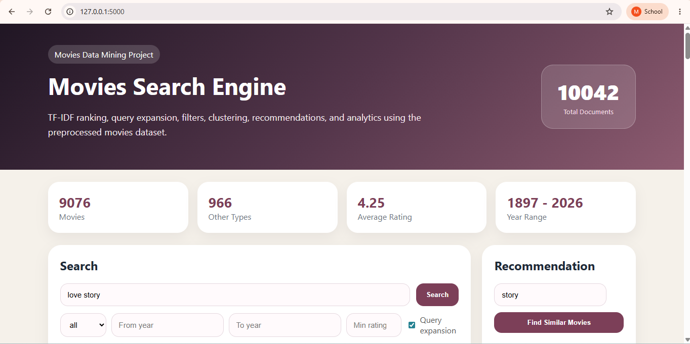
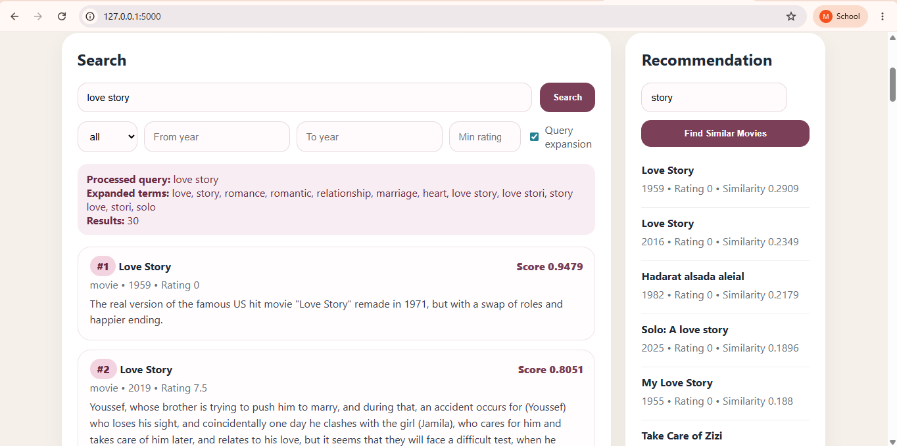
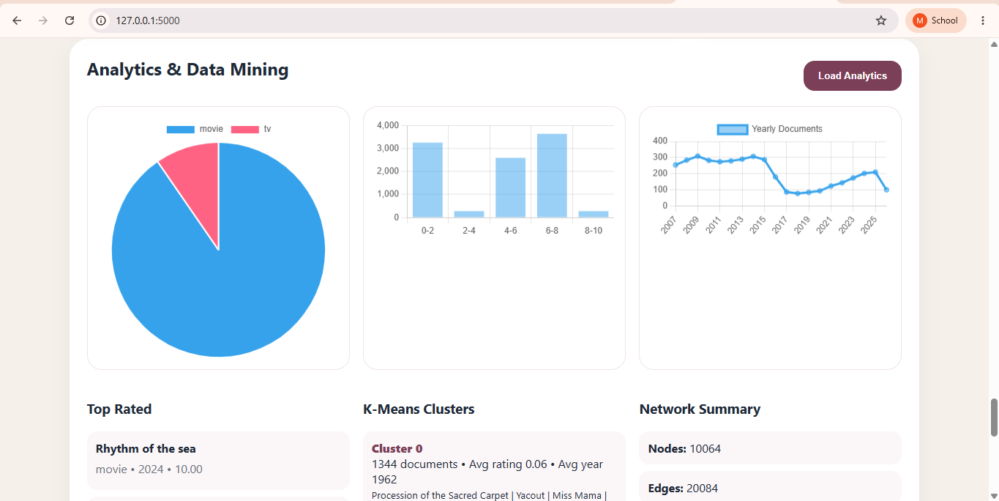

# 🔍 Movie Search Engine

A complete Information Retrieval (IR) system built as part of an academic project.  
The system supports efficient document indexing, ranking, and query processing using advanced IR techniques.

---

## 📌 Overview

This project implements a full search engine pipeline including:

- Text preprocessing (cleaning, tokenization, normalization)
- Indexing (Inverted Index)
- Ranking using **BM25**
- Query processing & retrieval
- Query Expansion (Phase 2 enhancement)
- Visualization of results and analytics

---

## 🚀 Features

- 🔎 Fast document retrieval using inverted index
- 📊 Ranking with BM25 algorithm
- 🔁 Query Expansion for improved search relevance
- 📈 Analytics dashboard for insights
- 💻 Simple UI for searching and displaying results

---

## ⚙️ Technologies Used

- Python 🐍
- Pandas
- NumPy
- Scikit-learn
- NLTK
- Matplotlib / Seaborn

---

## 🧠 Ranking Algorithm

### 🔹 BM25 (Best Matching 25)

- Uses term frequency and document length normalization
- More accurate than TF-IDF in ranking relevance

---

## 📊 System Workflow

1. Data Cleaning & Preprocessing  
2. Tokenization & Normalization  
3. Building Inverted Index  
4. Applying BM25 Ranking  
5. Query Processing  
6. Query Expansion (Phase 2)  
7. Display Results  

---

## 🖼️ Screenshots

### 🏠 Home Interface

---

### 🔍 Search Results

---

### 📊 Analytics Dashboard

---

## 👩‍💻 Author

Rowida

Engineering Student | Data Science Enthusiast  

---

## ⭐ Acknowledgment
